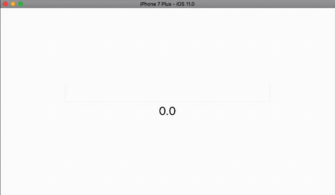

[](https://travis-ci.org/BenchR267/ParserCombinator)
[](http://mit-license.org)

# ParserCombinator

ParserCombinator is a WIP library that enables you to write parsers for a given grammer as easy as possible. Take for example a parser that is able to parse addition of two numbers:

```Swift
let digit = Parser<String, Int> { str in
    guard let first = str.characters.first, let number = Int(String(first)) else {
        return .fail(TestError(1))
    }
    return .success(result: number, rest: String(str.dropFirst()))
}

func char(_ c: Character) -> Parser<String, Character> {
    return Parser { str in
        guard let first = str.characters.first, first == c else {
            return .fail(TestError(1))
        }
        return .success(result: first, rest: String(str.dropFirst()))
    }
}

let addition = (digit ~ char("+") ~ digit).map { a, _, b in
    return a + b
}
let result = addition.parse("2+4")

try! result.unwrap() // Int: 6
```

# Why should I use this?

Parsing is a very common task, it does not always mean to parse source code or JSON strings. Parsing means to transform an unstructured input to a structured output. In case of source code this means to parse a raw string to an AST (abstract syntax tree), in case of an addition it means to parse the result of adding two numbers out of a string.
Parsing can always fail, if the input does not match the needed grammer. If the input string in the above example would have been `1+`, it would have been failed because the second number is missing.
The advantage of parser combinators is that you start with a very basic parser. In the above example `digit` parses only one digit. But it is not hard, to add a parser that parses more than one digit. A number is a repetition of mulitple digits. For repetition, we can use `rep`, which tries to apply the parser until it fails and collects the result as an array.
Parsing an integer addition is as easy as

```Swift
func intFromDigits(_ digits: [Int]) -> Int {
    return digits.reduce(0) { res, e in    
        return res * 10 + e
    }
}

let number = digit.rep.map(intFromDigits)
let addition = (number ~ char("+") ~ number).map { a, _, b in
    return a + b
}

let result = addition.parse("123+456")
try! result.unwrap() // Int: 579
```

# What are the disadvantages?

Since parser combinators are very high level, they abstract the whole process of parsing a lot. That means it is easier to use but it also means that the performance is not as good as an optimized, handwritten parser.

# Installation

ParserCombinator is currently available via Swift Package Manager and Cocoapods. Support for Carthage will come later.

## Swift Package Manager

To use it in your project, just add it as a dependency in your `Package.swift` file and run `swift package update`.

```Swift
import PackageDescription

let package = Package(
  name: "MyAwesomeApp",
  dependencies: [
    .Package(url: "https://github.com/BenchR267/ParserCombinator", majorVersion: 0)
  ]
)
```

## Cocoapods

While ParserCombinator is in active development and not officially released, you need to specify the Git-repository directly in your Podfile:

```Ruby
target 'MyAwesomeApp' do
  use_frameworks!

  pod 'ParserCombinator', :git => 'https://github.com/BenchR267/ParserCombinator', :branch => 'master'
end

```

# Requirements

* Swift 4.0
    * ParserCombinator is written in Swift 4.0 development snapshots and will be available when Swift 4.0 is released

# Example

Here is a quick example of a calculator written with ParserCombinator:



Sourcecode:

```Swift
internal func string(_ s: String) -> Parser<String, String> {
    return Parser { str in
        guard str.hasPrefix(s) else {
            return .fail(TestError(1))
        }
        return .success(result: s, rest: String(str.dropFirst(s.count)))
    }
}

internal let digit = Parser<String, Int> { str in
    guard let first = str.characters.first, let number = Int(String(first)) else {
        return .fail(TestError(1))
    }
    return .success(result: number, rest: String(str.dropFirst()))
}

internal let number = digit.rep.map { Double(Int($0.map(String.init).joined()) ?? 0) }

class Computer {
    static var factor: Parser<String, Double> {
        return number | char("(") >~ expr <~ char(")")
    }
    
    static var term: Parser<String, Double> {
        return (factor ~ ((string("*") ~ factor) | (string("/") ~ factor)).rep) ^^ {
            number, list in
            
            return list.reduce(number) { x, op in
                switch op.0 {
                case "*": return x * op.1
                case "/": return x / op.1
                default: fatalError("Expected * or / but got \(op.0)")
                }
            }
        }
    }
    
    static var expr: Parser<String, Double> {
        return (term ~ ((string("+") ~ term) | (string("-") ~ term)).rep) ^^ {
            number, list in
            
            return list.reduce(number) { x, op in
                switch op.0 {
                case "+": return x + op.1
                case "-": return x - op.1
                default: fatalError("Expected + or - but got \(op.0)")
                }
            }
        }
    }
}
```

# Author

* [@benchr](https://twitter.com/benchr), mail@benchr.de

# License

ParserCombinator is under MIT license. See the LICENSE file for more info. However, it is still in active development and I would not recommend to use it in production projects.
